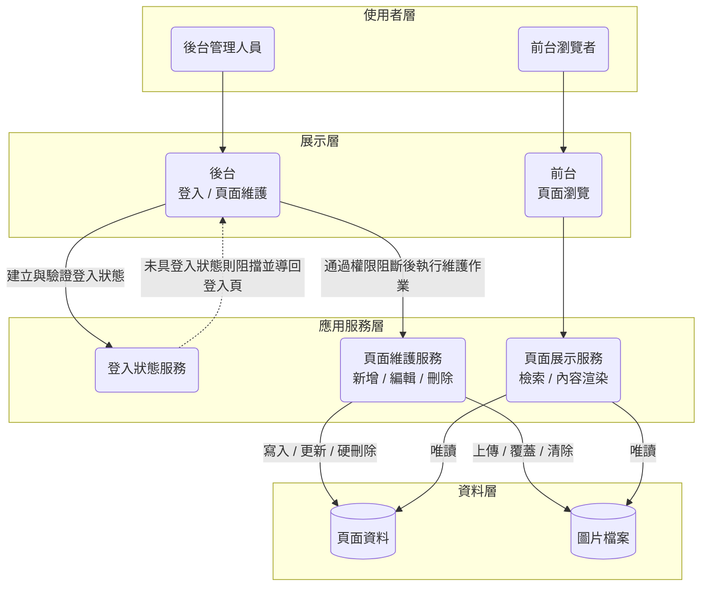
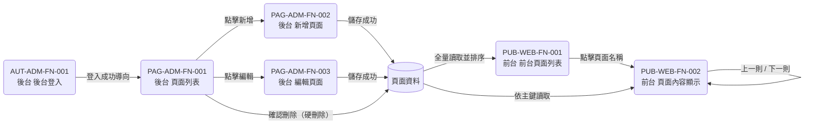

# 3.1 系統架構

## 1. 定位與章節邊界

本章定義系統的**邏輯組成**：平台劃分、分層職責、平台間資料流向、共用資料概念與外部整合關係，作為 Ch4 各功能檔定位其所屬平台與資料來源的依據。

### 1.1 本章不涵蓋

| 排除項 | 歸屬 |
| :--- | :--- |
| 主機規格、頻寬與網路架構 | 建置合約（SOW） |
| 備份機制與異地備援、SLA 可用率承諾 | 維運合約（SOW） |
| 資料表結構、欄位型別與索引設計 | Detail Design |
| 壓力測試數字（TPS、並發數） | 需實測，屬 SOW |
| 跨功能共通約束（權限阻斷、登入逾時、資料寫入失敗處理） | `3.2_非功能需求.md` 之 `NFR-###`，本章僅回指不複製 |
| 單一功能之流程、欄位定義、驗證規則與驗收條件 | Ch4 各原子化功能檔 |

---

## 2. 系統組成與平台

本系統由**兩個平台**構成，共用同一份頁面資料，不共用畫面與導覽。

| 平台代碼 | 平台名稱 | 使用者角色 | 存取控制 | 所轄 Function ID |
| :--- | :--- | :--- | :--- | :--- |
| `ADM` | 後台 | 後台管理人員 | 須具備登入狀態，依 `NFR-001`（`[AUT-ADM-FN-001]` 除外）；逾時失效依 `NFR-002` | [AUT-ADM-FN-001], [PAG-ADM-FN-001], [PAG-ADM-FN-002], [PAG-ADM-FN-003] |
| `WEB` | 前台 | 前台瀏覽者（不特定公眾） | 免登入瀏覽，且不得提供後台入口，依 `NFR-003` | [PUB-WEB-FN-001], [PUB-WEB-FN-002] |

> 平台代碼即 Function ID 第二段。`[AUT-ADM-FN-001] 後台 後台登入` 為 `NFR-001` 之明列例外，未具備登入狀態亦可開啟。
>
> 後台共用框架（選單「頁面管理」與「登出」）之元件定義與出現範圍見 `[PAG-ADM-FN-001] 後台 頁面列表`〈按鈕與動作〉。

---

## 3. 邏輯分層架構

### 3.1 分層職責

| 層級 | 職責 | 對應規格位置 |
| :--- | :--- | :--- |
| 展示層 | 承載使用者可見畫面與導覽，後台與前台各自獨立 | 各功能檔〈介面規格〉；前後台隔離依 `NFR-003` |
| 應用服務層 | 登入狀態之建立與失效、頁面資料之寫入與檢索、內容渲染 | 各功能檔〈商業邏輯表〉基本流程 |
| 資料層 | 頁面資料與圖片檔案之保存 | 寫入失敗處理依 `NFR-004` |

> 相依方向為單向：展示層 → 應用服務層 → 資料層。前台展示服務對資料層**僅具唯讀權限**，所有資料異動一律經後台維護服務。

---

## 4. 平台間資料流

### 4.1 資料生命週期

| 階段 | 觸發功能 | 對前台之影響 |
| :--- | :--- | :--- |
| 建立 | [PAG-ADM-FN-002] | 儲存成功後即出現於 [PUB-WEB-FN-001] |
| 更新 | [PAG-ADM-FN-003] | 儲存成功後前台即呈現新內容 |
| 刪除 | [PAG-ADM-FN-001] | 採硬刪除，該筆立即自 [PUB-WEB-FN-001] 消失；已開啟之 [PUB-WEB-FN-002] 重新載入時依其異常流程導回列表 |

> 本系統**無草稿、無審核、無排程上下架**：資料一經儲存即為前台可見狀態。

---

## 5. 共用資料概念

全系統僅有「頁面」一個業務實體，其概念屬性與規則定義位置如下。

| 概念屬性 | 業務語意 | 一致性規則定義位置 |
| :--- | :--- | :--- |
| 頁面名稱 | 業務唯一鍵，前台以此作為連結文字與頁面主標題 | [PAG-ADM-FN-002]（新增不可重複）、[PAG-ADM-FN-003]（檢核排除本筆） |
| 建立日期 | 由使用者指定，非系統寫入時間；為前後台列表之主要排序基準 | [PAG-ADM-FN-002]〈特殊規則〉3；排序見 [PAG-ADM-FN-001] 與 [PUB-WEB-FN-001]〈預設排序定義〉 |
| 建檔時序 | 系統維護、不對使用者顯示；建立日期相同時之次要排序依據 | [PAG-ADM-FN-002]〈特殊規則〉4 |
| 圖文區塊 | 附屬集合，儲存順序即前台由上而下之呈現順序 | [PAG-ADM-FN-002]〈特殊規則〉1、2；前台呈現見 [PUB-WEB-FN-002] |
| 區塊圖片 | 每組一張，單檔上傳 | [PAG-ADM-FN-002]、[PAG-ADM-FN-003]〈欄位定義〉與〈欄位驗證〉 |
| 頁面內容 | 以 HTML 保存並於前台原樣渲染 | [PAG-ADM-FN-002]〈欄位定義〉；前台呈現見 [PUB-WEB-FN-002] |
| 補充說明 | 純文字保存 | [PAG-ADM-FN-002]〈欄位定義〉；前台呈現見 [PUB-WEB-FN-002] |

### 5.1 刪除策略

全系統採**硬刪除（Hard-delete）**，不保留軟刪除旗標、不保留操作軌跡、不可復原。策略定義於 [PAG-ADM-FN-001]〈特殊規則〉1，前台連動效果見 [PUB-WEB-FN-001]〈特殊規則〉1 與 [PUB-WEB-FN-002]〈異常流程〉1。

---

## 6. 外部系統整合

本系統**不涉及任何外部系統介接**：無金流、無通知服務、無第三方登入、無檔案交換介面，圖片檔案保存於系統內部。因此不含 `API`／`SCH`／`QUE` 類型功能，亦不建 `3.3_跨系統整合視圖.md`。

---

## 7. 章節分工與追溯

| 內容性質 | 定義位置 | 其他文件如何取用 |
| :--- | :--- | :--- |
| 平台劃分、分層職責、資料流向、資料概念 | 本章 | 功能檔〈使用對象〉對齊本章之角色 |
| 跨功能共通約束 | `3.2_非功能需求.md` 之 `NFR-###` | 功能檔〈特殊規則〉以 `依 NFR-###` 回指，不複製內容 |
| 單一功能之流程、欄位、驗證、驗收條件 | Ch4 各原子化功能檔 | 以完整 Function ID 互相引用 |
| 資料表結構、欄位型別、索引 | Detail Design | 本 SRS 不涵蓋 |

> 追溯一律以 `NFR-###` 與 Function ID 為依據；章節號（`3.1`、`3.2`）僅作指路用，不得硬編為追溯鍵。
